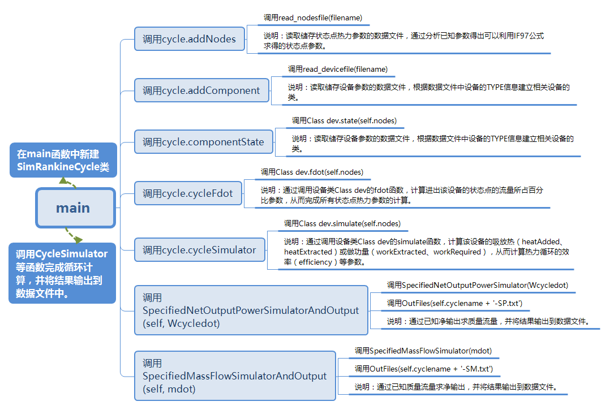

# **Practice 3**

#### **常大伟&nbsp; &nbsp; &nbsp; &nbsp; 03015318**

## **一.问题描述及分析**

* **描述：** 通用Rankine Cycle计算程序设计：能够解析数据文件描述的循环系统拓扑结构，读取热力参数，计算出循环的各项数据，并将结果输出到数据文件。

* **分析：** (1)实现读取数据文件；(2)实现循环中状态点和各项数据的计算；(3)实现循环数据输出到数据文件中。

## **二.问题描述及分析**

## **三.小结**
